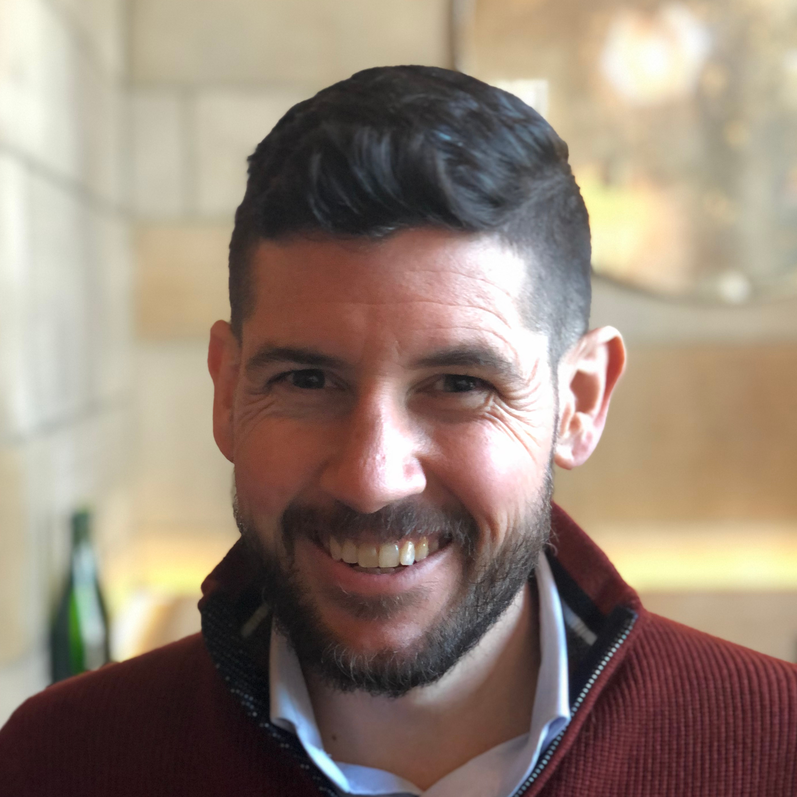

# What I do

I'm an Assistant Professor in the [Department of Linguistics](http://www.sas.rochester.edu/lin/index.html) at the [University of Rochester](https://www.rochester.edu/), with secondary appointments in the [Department of Computer Science](https://www.cs.rochester.edu/) and the [Department of Brain and Cognitive Sciences](http://www.sas.rochester.edu/bcs/) and an affiliation with the [Goergen Institute for Data Science](http://www.sas.rochester.edu/dsc/). I'm also Director of the [FACTS.lab](http://factslab.io) at UR, and I co-lead the [MegaAttitude Project](http://megaattitude.io) and the [Decompositional Semantic Initiative](http://decomp.io) with [Ben Van Durme](http://www.cs.jhu.edu/~vandurme/) and [Kyle Rawlins](http://sites.krieger.jhu.edu/rawlins/).

# How to find me

| **Email**    | [{{ site.author.mail }}](mailto:{{ site.author.mail }})                           |
| **Github**   | [{{ site.author.github }}](http://github.com/{{ site.author.github }})              |
| **Twitter**  | [{{ site.author.twitter }}](http://twitter.com/{{ site.author.twitter }})           |
| **Office**   | 511A Lattimore Hall                                                                 |

# Recent publications

**White, A. S.**, R. Rudinger, K. Rawlins, & B. Van Durme. 2018. [Lexicosyntactic Inference in Neural Models](https://arxiv.org/pdf/1808.06232.pdf). To appear in _Proceedings of the 2018 Conference on Empirical Methods in Natural Language Processing_, Brussels, Belgium, October 31-November 4, 2018.

Poliak, A., A. Haldar, R. Rudinger, J.E. Hu, E. Pavlick, **A. S. White**, & B. Van Durme. 2018. [Towards a Unified Natural Language Inference Framework to Evaluate Sentence Representations](https://arxiv.org/pdf/1804.08207). To appear in _Proceedings of 2018 Conference on Empirical Methods in Natural Language Processing_, Brussels, Belgium, October 31-November 4, 2018.

Rudinger, R., **A. S. White**, & B. Van Durme. 2018. [Neural Models of Factuality](http://aclweb.org/anthology/N18-1067). In _Proceedings of the 2018 Conference of the North American Chapter of the Association for Computational Linguistics_, pages 731–744, New Orleans, LA, June 1 – June 6, 2018.

**White, A. S.** & K. Rawlins. 2018. [The role of veridicality and factivity in clause selection](papers/white_role_2018.pdf). To appear in the *Proceedings of the 48th Meeting of the North East Linguistic Society*.

# Upcoming presentations

**White, A. S.**, R. Rudinger, K. Rawlins, & B. Van Durme. 2018. [Lexicosyntactic Inference in Neural Models](https://arxiv.org/pdf/1808.06232.pdf). To be presented at the 2018 Conference on Empirical Methods in Natural Language Processing, Brussels, Belgium, October 31-November 4, 2018.

Poliak, A., A. Haldar, R. Rudinger, J.E. Hu, E. Pavlick, **A. S. White**, & B. Van Durme. 2018. [Towards a Unified Natural Language Inference Framework to Evaluate Sentence Representations](https://arxiv.org/pdf/1804.08207). To be presented at the 2018 Conference on Empirical Methods in Natural Language Processing, Brussels, Belgium, October 31-November 4, 2018.

**White, A. S.** 2018. Distribution, Inference, and Event Structure. Colloquium talk to be given at Stanford University, October 12, 2018.

**White, A. S.** & K. Rawlins. 2018. [The typology of veridicality inferences](presentations/abstracts/white_nels49_abstract.pdf). Talk to be given at the 49th annual meeting of the North East Linguistic Society, Cornell University, October 5-7, 2018.

Rudinger, R., **A. S. White**, & B. Van Durme. 2018. [Neural Models of Factuality](presentations/slides/rudinger_naacl2018_slides.pdf). Talk given at the 2018 Conference of the North American Chapter of the Association for Computational Linguistics, New Orleans, LA, June 1 – June 6, 2018.

# Where I've been

I received my BA in [Linguistics](http://linguistics.ucsc.edu/) from the [University of California, Santa Cruz](http://ucsc.edu/) in 2009, followed by a year in the [Department of Linguistics](http://ling.umd.edu/) at the [University of Maryland](http://umd.edu/) as a [Baggett Fellow](http://ling.umd.edu/baggett/). I went on to receive my PhD in [Linguistics](http://ling.umd.edu/) from the [University of Maryland](http://umd.edu/) in 2015. My dissertation, [_Information and Incrementality in Syntactic Bootstrapping_]({{ site.url }}/papers/white_information_2015.pdf), was co-advised by [Valentine Hacquard](http://ling.umd.edu/~hacquard/) and [Jeff Lidz](http://ling.umd.edu/~jlidz/).

From 2015 to 2017, I was a postdoctoral fellow at [Johns Hopkins University](http://jhu.edu)'s [Science of Learning Institute](http://scienceoflearning.jhu.edu/) with affiliations in the [Department of Cognitive Science](http://cogsci.jhu.edu/) and the [Center for Language and Speech Processing](http://www.clsp.jhu.edu/). While at Hopkins, I worked on the [JHU Decompositional Semantics Initiative (Decomp)](http://decomp.net/), led by [Ben Van Durme](http://www.cs.jhu.edu/~vandurme/) and [Kyle Rawlins](http://sites.krieger.jhu.edu/rawlins/), and I led the [MegaAttitude Project](http://megaattitude.io) with [Kyle Rawlins](http://sites.krieger.jhu.edu/rawlins/).
